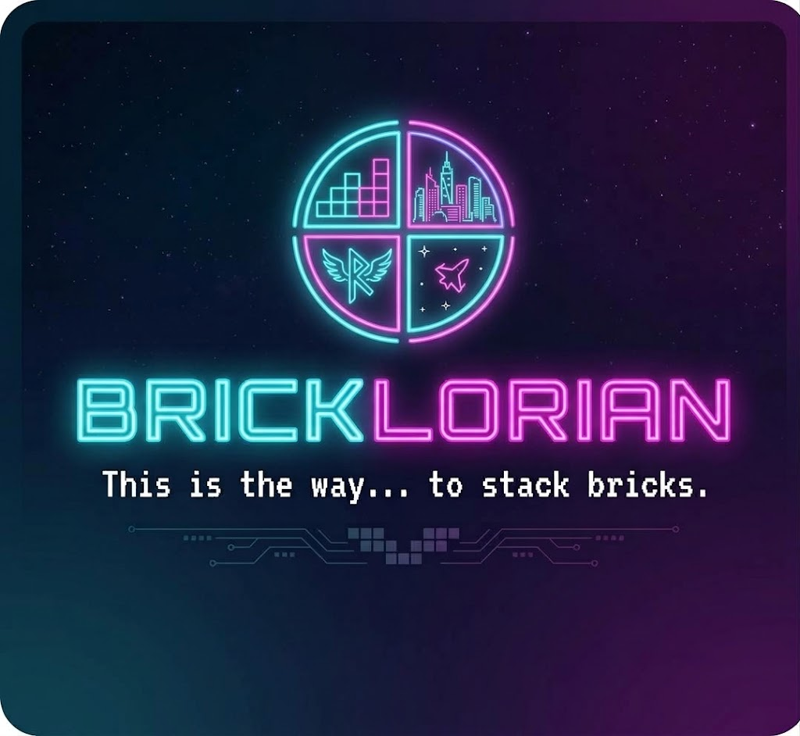

# BRICKLORIAN

**This is the way... to stack bricks.**

[](LICENSE)


A classic falling-block game reimagined: **4 themed worlds**, a **UI in 36 languages**, and a **7-track original OST** — all in pure vanilla HTML, CSS and JavaScript. No frameworks, no build step, no npm, no servers: open `index.html` and play.



---

## Play

- **Live version:** [https://bricklorian.net/](https://bricklorian.net/)
- **Locally:** just open [`index.html`](index.html) in any modern browser. That's it — no build, no dependencies. The game works offline.

## How to play

| Key | Action |
| --- | --- |
| `←` / `→` | Move |
| `↑` | Rotate |
| `↓` | Soft drop |
| `Space` | Hard drop |
| `P` | Pause |
| `R` | Restart |
| `Esc` | Menu |
| `C` | Credits (on the game-over screen) |

Pick a style from the main menu before playing:

| World | Vibe | Score-clear FX | Music |
| --- | --- | --- | --- |
| **Classic** | 80s arcade — pure, simple retro | Crumbling debris + white flash | *The Last Quarter* |
| **Neon City** | Neon, chrome and the night city | Glitch slices + neon streaks | *Hardwired Pursuit* |
| **Rune Realm** | Gold, runes and enchanted stones | Magic ring burst + rising embers | *Beneath the Crowned Stone* |
| **Star Drift** | Star fields, gold and steel | Energy beam sweep + star sparks | *Beyond the Last Horizon* |

Each world has its own **static or animated** background, its own line-clear effect, its own soundtrack, and its own 16 line-clear jingles (4 line counts × 4 themes) synthesized live in the browser with the **Web Audio API** — no audio files, no samples.

## Features

- Standard 10 × 20 board, Canvas 2D rendering at a steady **60 fps**
- Wall-kick rotation, soft/hard drop, pause, restart, next-piece preview
- n² scoring (1·4·9·16), level-up tempo — one step faster every 10 lines
- **36 UI languages**, auto-detected from the browser with in-game selection
- **7 original OST tracks**, one per context (menu, each world, game over, credits)
- Music handoff: the title-page theme continues seamlessly into the menu
- Accessible touches: `aria-pressed` toggles, `prefers-reduced-motion` support
- Works fully offline after first load (fonts degrade gracefully)

## Project structure

```
bricklorian/
├── index.html                  # Title / landing page (title art, music toggle)
├── game/
│   ├── index.html              # Game page: board, panel, menu, game over, 36-language UI
│   ├── credits.html            # Rolling credits, track list, lightning
│   ├── css/
│   │   ├── layout.css          # Board, panel, menu layout
│   │   ├── themes.css          # World palettes & line-clear FX
│   │   └── background.css      # Static & animated world backgrounds
│   └── js/
│       ├── config.js           # Board, shapes, theme palettes & FX params
│       ├── engine.js           # Game loop, movement, rotation (wall-kick), scoring
│       ├── render.js           # Canvas rendering, debris/glitch/ember/spark FX
│       ├── ui.js               # Menu, theme/language/background pickers
│       ├── i18n.js             # 36-language UI string catalog
│       ├── music.js            # OST track routing & autoplay policy handling
│       ├── sfx.js              # Web-Audio-synthesized line-clear jingles
│       └── main.js             # Boot, keyboard controls, state restore
├── music/                      # BRICKLORIAN OST — 7 original compositions (MP3)
└── pics/                       # Title art, favicon
```

## Credits

- **Concept, direction & release:** [Mariusz Aleksandrowicz](https://www.linkedin.com/in/mariuszaleksandrowicz) — idea, game design, music & art prompts
- **Code:** [Qwen 3.8](https://huggingface.co/Qwen) via [Ollama](https://ollama.com), driven by [OpenCode](https://opencode.ai) (agentic coding harness); QA via an automated Node.js harness with DOM simulation
- **Music:** [Gemini · Lyria](https://deepmind.google/technologies/lyria/) (Google DeepMind) — 7 original compositions from the author's own prompts
- **Graphics:** [Gemini · Imagen](https://ai.google) (Google) — logo, title art and favicon from the author's own prompts

## About & Legal

- **Project purpose:** This is a non-commercial, private educational and research project aimed at exploring the feasibility of end-to-end software development exclusively through AI agents running in a local environment.
- **Trademark notice:** This game is an independent tile-matching puzzle inspired by classic mechanics. It is not affiliated with, endorsed by, or connected to The Tetris Company.
- **AI-driven workflow:** Zero lines of code were written by hand. The codebase was generated iteratively with OpenCode and a local Qwen model (Ollama). Media and audio assets were generated with Gemini.
- **License:** Released under the [MIT License](LICENSE) for educational and portfolio demonstration purposes.

## License

MIT — see [LICENSE](LICENSE).
